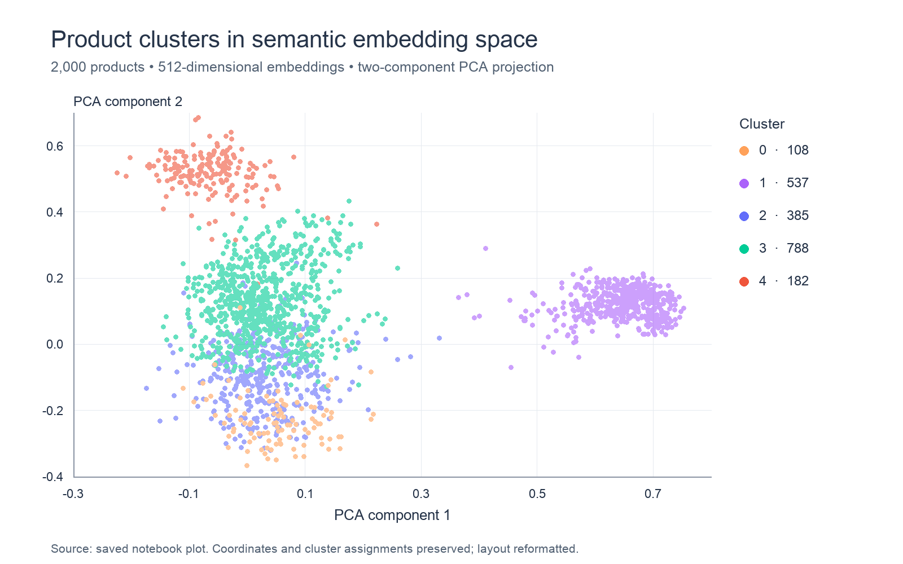

# Semantic Product Recommendations

**Turn product descriptions and recent browsing activity into relevant recommendation candidates using text embeddings and Apache Spark.**

This project builds a content-based recommendation prototype for a retail catalog. It encodes product titles and descriptions with OpenAI embeddings, groups products with PySpark K-means, and uses a shopper’s recently viewed items to select candidate clusters. A two-dimensional PCA visualization makes the resulting catalog structure easier to inspect.

The saved demonstration follows a browsing history containing rugs and paints and returns five unseen products from each of the two associated clusters. It demonstrates the complete path from catalog text to recommendation candidates; recommendation quality and commercial impact remain to be evaluated.

[Explore the notebook](The_Notebook.ipynb) · [View the cluster map](assets/product-clusters.png)

## Why this project

Retail catalogs contain useful signals in product text even when ratings or purchase histories are unavailable. This prototype explores how those signals can support product discovery from a short browsing session, without training on a user–item interaction matrix.

The business objective is to surface plausible alternatives within a shopper’s current areas of interest. The implementation demonstrates text feature engineering, distributed data transformations, unsupervised modeling, visual inspection, and session-based candidate generation.

## Dataset

The notebook reads a local file, `products_dataset.csv`, with one intended record per product:

| Field | Purpose |
| --- | --- |
| `product_id` | Product identifier used for filtering and recommendation lookup |
| `title` | Product name and attributes |
| `description` | Longer product information |

Saved examples include paints, rugs, tools, fixtures, apparel, and home furnishings. The embedded plot contains **2,000 points with 2,000 distinct product IDs**, establishing the size of the plotted catalog. The original CSV was not supplied with the notebook, so this count comes from the saved visualization rather than a fresh source-file audit.

A manually specified list of **eight recently viewed product IDs** supplies the example browsing history. No ratings, purchases, timestamps, or labeled relevance judgments are used. Dataset provenance, collection date, and license are not documented in the notebook.

## Methodology

```text
Product titles + descriptions
             ↓
OpenAI text embeddings — 512 dimensions
             ↓
Spark feature vectors → K-means — 5 clusters
             ├── PCA — 2 components → catalog visualization
             ↓
Clusters containing recently viewed products
             ↓
Exclude viewed products → sample 5 candidates per cluster
```

1. **Prepare catalog text.** Read the CSV into Spark and concatenate each product’s title and description into `combined_text`.
2. **Generate semantic features.** Collect the text to the driver and request 512-dimensional vectors from `text-embedding-3-small`.
3. **Build the feature table.** Convert the returned vectors into Spark columns and assemble them with `VectorAssembler`. The original notebook attaches embeddings through generated row IDs; see the alignment limitation below.
4. **Cluster the catalog.** Fit PySpark `KMeans` with `k=5` on the full embedding vectors. Five clusters are configured directly; no search for an optimal value of `k` is recorded.
5. **Inspect the representation.** Fit a two-component PCA model and plot its coordinates with Plotly. PCA is used for visualization; clustering uses all 512 embedding dimensions.
6. **Generate recommendations.** Find the clusters represented in the browsing history, exclude already viewed IDs, and use NumPy to sample five products without replacement from each selected cluster.

The final selection is random within each eligible cluster. The notebook does not calculate similarity scores, produce a relevance ranking, or train a supervised prediction model.

## Results and insights

### Catalog structure



*Re-rendered from the notebook’s embedded Plotly data. All coordinates, product IDs, cluster assignments, and cluster colors are preserved; the layout and title are reformatted for readability. Legend counts are calculated from the saved plot. The original title mentions recently viewed products, but the saved figure contains no separate browsing-history markers.*

| Cluster ID | Products in saved plot | Share of plotted catalog |
| --- | ---: | ---: |
| 0 | 108 | 5.40% |
| 1 | 537 | 26.85% |
| 2 | 385 | 19.25% |
| 3 | 788 | 39.40% |
| 4 | 182 | 9.10% |
| **Total** | **2,000** | **100.00%** |

Cluster 1 appears distinctly separated along the first PCA component, while several other clusters overlap in the projection. The saved recommendation examples associate cluster 1 with paints and cluster 4 with rugs. These examples support a qualitative interpretation of the selected groups, not verified category labels for every member: cluster 4 also contains the displayed “Large Tapestry Bolster Bed” product.

PCA explained variance and quantitative clustering metrics are not reported, so the two-dimensional separation should not be treated as a measure of recommendation quality.

### Example recommendation session

The eight viewed items comprise four rugs and four paint products. Their saved cluster assignments are **4 and 1**.

| Stage | Observed or derived result |
| --- | --- |
| Browsing-history input | 8 product IDs |
| Selected clusters | 4 and 1 |
| Products in those clusters | 719, calculated from the saved plot |
| Eligible unseen candidates | 711: 178 in cluster 4 and 533 in cluster 1 |
| Final sample | 10 products: 5 from each selected cluster |

The following IDs are copied from the saved recommendation output. Their order is not a ranking.

| Cluster | Sampled product IDs | Examples printed in the notebook |
| --- | --- | --- |
| 4 | `P967`, `P1502`, `P101`, `P1001`, `P1168` | Pueblo Multi-Colored Area Rug; Blossom Ivory/Gray Runner Rug; Drey Ombre Shag Sky Blue Area Rug |
| 1 | `P81`, `P418`, `P182`, `P159`, `P729` | Deer Trail Exterior Paint & Primer; Black Cherry Metallic Interior Paint; First Peach Interior Paint & Primer |

The demonstration retains both broad interests from the browsing history and excludes previously viewed products. It also exposes the limits of broad semantic grouping: paint suggestions span finishes and interior/exterior uses, without explicit attribute constraints. A production recommender would need to distinguish topical similarity from actual suitability.

**Evaluation status:** no held-out test set, Precision@K, Recall@K, NDCG, silhouette score, latency benchmark, or online experiment is included. No improvement in conversion, revenue, or engagement is claimed.

## Technology

| Layer | Tools |
| --- | --- |
| Data ingestion and transformations | Python, PySpark SQL |
| Text representation | OpenAI Python SDK, `text-embedding-3-small` |
| Unsupervised modeling | PySpark ML `VectorAssembler`, `KMeans`, `PCA` |
| Local tabular processing and sampling | pandas, NumPy |
| Visualization | Plotly Express |
| Notebook and configuration | Jupyter / Google Colab, python-dotenv |

## Repository layout

```text
.
├── README.md
├── The_Notebook.ipynb                 # Original notebook with saved outputs
└── assets/
    ├── product-clusters.png          # Static README visualization
    └── product-clusters.plotly.json  # Extracted original figure data and layout
```

To rerun the analysis, also provide `products_dataset.csv` and a local `apikey.env.txt` at the repository root. Neither the dataset nor credentials are included. The structure above describes this documentation package; no application service, deployment configuration, or automated test suite is present.

## Getting started

The saved outputs can be reviewed without executing the notebook. A fresh run requires the original CSV, an OpenAI API key with access to the embedding model, and compatible Python, Java, and PySpark installations. The notebook does not record a complete, tested environment lockfile.

### 1. Prepare a local environment

From the repository root:

```bash
python -m venv .venv
source .venv/bin/activate
python -m pip install jupyterlab python-dotenv openai pyspark pandas numpy plotly
```

On Windows, activate with `.venv\Scripts\activate`. Install a Java runtime compatible with the PySpark version you choose and make it available to Spark. These dependencies are inferred from the notebook imports; this is an unpinned setup recipe, not a verified reproduction environment.

### 2. Supply the inputs

Place the original `products_dataset.csv` beside the notebook. It must contain `product_id`, `title`, and `description`; the demonstration also expects its eight hard-coded viewed IDs to exist.

Create a local `apikey.env.txt`:

```dotenv
APIKEY=your_api_key_here
```

Add the following entries to your `.gitignore` before committing local configuration:

```gitignore
.venv/
apikey.env.txt
.ipynb_checkpoints/
```

### 3. Address the recorded setup issues

- Replace the first cell’s invalid `!pip python-dotenv pyspark` command with `%pip install python-dotenv pyspark`, or skip that installation cell after installing the dependencies above. Its saved output contains an installation error.
- Remove `print(f"API Key loaded: {APIKEY}")` from the API configuration cell so executing the notebook does not expose the credential in its output.
- For a reliable rerun, carry `product_id` with each input text and returned embedding, then join by `product_id`. The notebook currently creates independent row IDs after repartitioning; this is not a reliable ordering contract between the two tables.

### 4. Run and inspect

```bash
jupyter lab The_Notebook.ipynb
```

Run the cells in sequence after the adjustments above. Embedding generation sends catalog text to the API and incurs API usage. Confirm product–embedding alignment, inspect the cluster map, and review the sampled recommendation titles.

The original notebook is included unchanged. It was inspected, not rerun, when preparing this README. The missing CSV prevents end-to-end verification, and the original code specifies no explicit K-means or NumPy random seed. Cluster IDs and sampled recommendations may differ between runs.

## Limitations and next steps

| Current limitation | Next step |
| --- | --- |
| Independently generated row IDs can misalign products and embeddings | Join on stable product IDs and validate one-to-one coverage before fitting |
| Text and plotting data are collected to the driver; embeddings are requested in one call | Batch and cache embeddings, add retries, and avoid full driver collection for larger catalogs |
| Cluster count is fixed at five without comparison | Compare cluster counts, assess stability, and inspect representative products |
| Candidates are sampled randomly and clusters receive equal output quotas | Rank by similarity to viewed products or a session profile; test relevance and diversity tradeoffs |
| Sampling assumes at least five eligible products per selected cluster | Handle small candidate pools, missing IDs, and empty browsing histories |
| No relevance labels or evaluation baseline | Create a held-out interaction dataset and compare against random, popularity, and text-similarity baselines |
| No stock, price, category, or attribute constraints | Add suitability filters and assess recommendation coverage |
| Source provenance and environment are incomplete | Document dataset rights and origin, pin dependencies, and version data and model artifacts |

The next milestone is a reproducible, evaluated candidate-ranking pipeline. The current notebook provides the exploratory foundation and a concrete example of how product semantics can connect catalog organization to browsing-driven recommendations.
